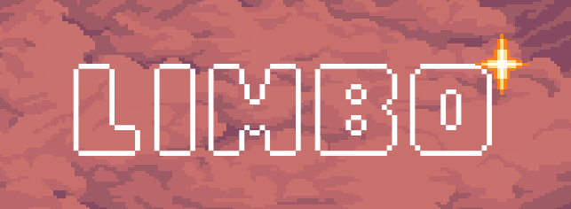

**Título:** Limbo  
**Web:** [https://nurshv.itch.io/limbo](https://nurshv.itch.io/limbo)  
**Autor:** Patricia Lucía López Telyubaeva  
**Resumen:**  
La historia de Garu, un viajero que un día desea dejar de ser humano. Su deseo es escuchado por una voz misteriosa que lo convierte en rana. Ahora, deberá explorar el mundo en busca de la forma de romper su maldición.  
**Estilo/Género:** Novela visual interactiva; estilo *point and click* con elementos narrativos y minijuegos.  
**Resolución:** 1280 x 720 px  
**Probado en:** Google Chrome, Firefox  
**Tamaño del proyecto:** 129 MB  
**Licencia:** Creative Commons Reconocimiento Compartir Igual (CC BY-SA)  
**Fecha:** 28/05/2025  
**Medios:**
- GitHub  
- Itch.io: [https://nurshv.itch.io/limbo](https://nurshv.itch.io/limbo)

**Logotipo:**  

> *Diseño que refleja el carácter pixelado del juego, inspirado en títulos como Kirby y Blasphemous. Un cielo estrellado de deseos.*

---

# 2. Memoria del Proyecto

## 2.1 Storyboard

La historia sigue a **Garu**, un viajero que, hastiado de su vida como humano, desea dejar de serlo. Su deseo es concedido y es transformado en rana. A lo largo del juego, Garu explora escenarios extraños, resuelve minijuegos y toma decisiones que lo acercan (o alejan) de su humanidad perdida.

**Imágenes de apoyo:**  

## 2.2 Esquema de Navegación
[Menú Principal]
├── Jugar
│   └── [Escena Intro]
│       └── [Escena Pueblo]
│           ├── [Minijuego de Cartas]
│           └── [Escena Cruce]
│               └── [Ending]
├── Galería
│   └── [Escena Galería]
├── Créditos
│   └── [Escena Créditos]
└── Ajustes
    └── [Escena Ajustes]

# 3. Metodología

## Etapa 1: Ideación del proyecto

**Inspiración visual y técnica:**
- Juegos como *Fear and Hunger*, *Blasphemous* o *Kirby*
- Una de mis mayores inspiraciones fue Fear and Hunger ya que es un juego que disfruté mucho jugar y resulta que lo hicieron unos estudiantes para su carrera universitaria, por lo que al haber tenido esa misma oportunidad quise intentarlo támbien.

**Motivación:**  
Me encantan el arte en píxeles y la fantasía. Nunca pensé que podría desarrollar un juego, y este proyecto me permitió explorar esa posibilidad.

**Público objetivo:**  
Adolescentes y jóvenes interesados en novelas visuales, decisiones narrativas y mundos de fantasía.

## Etapa 2: Desarrollo / Actividades realizadas

### 🎮 Juego

El núcleo del proyecto es una **novela visual interactiva** con una estructura *point and click* y un **minijuego de cartas** que influye en el desarrollo de la historia. Uno de los mayores retos que me surgió durante la programación del personaje **Bonifacio**: tras completar el minijuego de cartas, me costaba conseguir que su diálogo cambiara correctamente y respondiera de forma coherente al resultado del juego. Durante bastante tiempo no lograba actualizar su diálogo tras la interacción, lo que rompía la narrativa. Finalmente, conseguí solucionarlo organizando mejor las condiciones de cambio de escena y el flujo de variables que controlan el estado del personaje, y hoy es una de las interacciones que más me enorgullecen del proyecto.

También programé un **sistema de decisiones** que condiciona ciertas respuestas y progresos dentro de la historia, así como un sistema de diálogo sencillo pero funcional que permite a los personajes reaccionar de manera contextual a las acciones del jugador.

### 🎨 Animaciones

Las animaciones fueron uno de los apartados que más disfruté. No tuve dificultades importantes al integrarlas en el juego. Realicé animaciones para **la introducción, el final del juego y las acciones de los personajes**. La intro especialmente fue muy gratificante, ya que ayudó a construir el tono melancólico y fantástico de la historia. Todo fue hecho con herramientas que domino como **Procreate** y **Pixquare**, lo que me permitió mantener una estética coherente en pixel art.

Aunque no fue necesario, me hubiera encantado tener tiempo para añadir más animaciones en las transiciones o en las decisiones clave, quizás con efectos que representaran mejor el estado emocional del protagonista.

### 🎥 Video

La escena introductoria funciona como una animación estilo teaser que abre el juego. Afortunadamente, **no tuve problemas técnicos** al integrar este vídeo, ya que utilicé un flujo directo dentro de **Godot Engine**, estableciendo triggers entre el final del vídeo y el cambio de escena.

### 🔊 Audio y Música

Una de las primeras dificultades fue hacer que la música se mantuviera al cambiar de escena. Al principio, cada transición cortaba el audio abruptamente, rompiendo la inmersión. Al final la solución fue aprender a usar **nodos autoload o escenas globales** en Godot, lo que me permitió mantener un **control centralizado del audio**, y así garantizar que sonara de forma continua o contextual según la escena.

También añadí **efectos de sonido** que acompañan algunas acciones clave, como los botones o los eventos del minijuego.

### 🧭 Menús y navegación

Diseñé todos los botones y elementos interactivos del menú en pixel art usando **Pixquare**. Aunque visualmente funcionaban bien desde el inicio, tuve que solucionar un pequeño problema: **el sonido no se reproducía al hacer clic** en los botones porque la escena cambiaba tan rápido que el efecto no llegaba a sonar. La solución fue sencilla pero efectiva: añadí un **Timer de 0.5 segundos** antes del cambio de escena, lo que permitió que el sonido se reprodujera completamente.

El sistema de navegación es intuitivo y cuenta con menús para acceder a la galería de personajes, al juego de cartas, y a distintas secciones del juego.

### 🖼️ Galería de personajes

Incluí una pequeña galería con ilustraciones de personajes claves. Aunque esta parte no presentó problemas, me gustaría haber añadido una versión más compleja que reaccionara a las decisiones del jugador, mostrando versiones alternativas de los personajes o información desbloqueable según el progreso en el juego.

## Etapa 3: Problemas detectados

- El punto más débil del juego es su **duración**. Me hubiera gustado poder desarrollarlo más para tener una historia más completa y ramificada.

# 4. Conclusiones

Este proyecto fue un gran reto creativo y técnico. Me permitió **mejorar mis habilidades de animación** y aprender nuevas herramientas como **Godot**. Me exprimió al máximo creativamente.

**A futuro me gustaría:**
- Ampliar la historia
- Incluir más minijuegos
- Añadir más personajes y decisiones con múltiples finales

# 5. Referencias

### Artículos y blogs
- https://docs.godotengine.org/
- https://youtu.be/94r4mvvccsg?si=TLIup1pjm3qUwcn3 (https://youtu.be/94r4mvvccsg?si=TLIup1pjm3qUwcn3)

### Recursos y materiales

**Música:**  
- Compositor: Pizza Doggy — disponible gratuitamente en Itch.io

**Tipografía:**  
- Undertale Sans OTF

**Imágenes:**  
- Ilustraciones propias en pixel art

### Herramientas utilizadas

- Godot Engine  
- Procreate  
- Pixquare

  Mayo 2025
