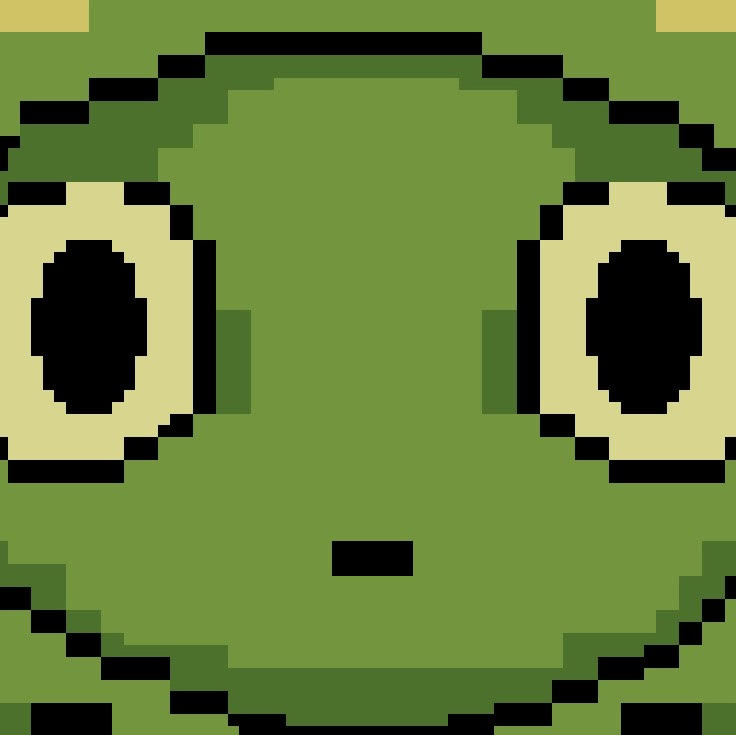

## LIMBO

**Proyecto de Creación Multimedia Interactiva**  
Facultad de Bellas Artes — Universidad de Granada

---

# 1. Datos

**Título:** Limbo  
**Web:** [https://nurshv.itch.io/limbo](https://nurshv.itch.io/limbo)  
**Autor:** Patricia Lucía López Telyubaeva  
**Resumen:**  
La historia de Garu, un viajero que un día desea dejar de ser humano. Su deseo es escuchado por una voz misteriosa que lo convierte en rana. Ahora, deberá explorar el mundo en busca de la forma de romper su maldición.  
**Estilo/Género:** Novela visual interactiva; estilo *point and click* con elementos narrativos y minijuegos.  
**Resolución:** 1280 x 720 px  
**Probado en:** Google Chrome, Firefox  
**Tamaño del proyecto:** 30 MB  
**Licencia:** Creative Commons Reconocimiento Compartir Igual (CC BY-SA)  
**Fecha:** 28/05/2025  
**Medios:**
- GitHub  
- Itch.io: [https://nurshv.itch.io/limbo](https://nurshv.itch.io/limbo)

**Logotipo:**  
src="logolimbo.png" alt="garu rana" height="100

> *Diseño pixelado para reflejar el carácter retro del juego, inspirado en títulos como Kirby y Blasphemous. La estrella simboliza el deseo y la transformación mágica.*

---

# 2. Memoria del Proyecto

## 2.1 Storyboard

La historia sigue a **Garu**, un viajero que, hastiado de su vida como humano, desea dejar de serlo. Su deseo es concedido y es transformado en rana. A lo largo del juego, Garu explora escenarios extraños, resuelve minijuegos y toma decisiones que lo acercan (o alejan) de su humanidad perdida.

**Imágenes de apoyo:**  

*(Puedes añadir más capturas aquí si lo deseas.)*

---

## 2.2 Esquema de Navegación

(Agregar una imagen del mapa de navegación hecho en draw.io u otra herramienta visual.)

---

# 3. Metodología

Metodología de desarrollo basada en diseño centrado en la experiencia de usuario (UX).

## Etapa 1: Ideación del proyecto

**Inspiración visual y técnica:**
- [Leonardi Web page](http://www.rleonardi.com/interactive-resume/)
- Juegos como *Blasphemous* y *Kirby* clásicos

**Motivación:**  
Me encantan el arte en píxeles y la fantasía. Nunca pensé que podría desarrollar un juego, y este proyecto me permitió explorar esa posibilidad.

**Público objetivo:**  
Adolescentes y jóvenes interesados en novelas visuales, decisiones narrativas y mundos de fantasía.

---

## Etapa 2: Desarrollo

**Contenido incluido:**
- Decisiones interactivas que afectan el curso del juego
- Animaciones en pixel art
- Galería visual de personajes
- Texto narrativo
- Música y efectos sonoros
- Video introductorio
- Minijuego de cartas

---

## Etapa 3: Problemas detectados

- El punto más débil del juego es su **duración**. Me hubiera gustado poder desarrollarlo más para tener una historia más completa y ramificada.

---

# 4. Conclusiones

Este proyecto fue un gran reto creativo y técnico. Me permitió **mejorar mis habilidades de animación** y aprender nuevas herramientas como **Godot**. Me exprimió al máximo creativamente.

**A futuro me gustaría:**
- Ampliar la historia
- Incluir más minijuegos
- Añadir más personajes y decisiones con múltiples finales

---

# 5. Referencias

### Artículos y blogs

- Crofts, S., Fox, M., Retsema, A. and Williams, B. (2005) *Podcasting: A new technology in search of viable business models*. First Monday, 10(9). https://doi.org/10.5210/fm.v10i9.1273

### Recursos y materiales

**Música:**  
- Compositor: Pizza Doggy — disponible gratuitamente en Itch.io

**Tipografía:**  
- Undertale Sans OTF

**Imágenes:**  
- Ilustraciones propias en pixel art

### Herramientas utilizadas

- Godot Engine  
- Procreate  
- Pixquare  
- Hippani Animator 5.1

(imagen de la licencia, copiar y pegar aquí la correcta)

https://creativecommons.org/licenses/?lang=es

Mayo 2023
